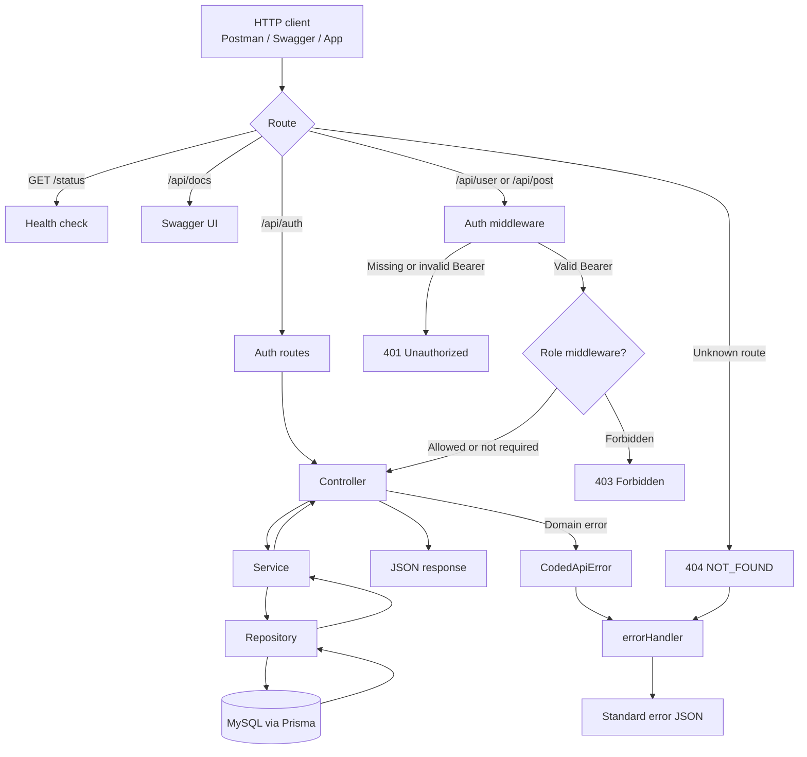
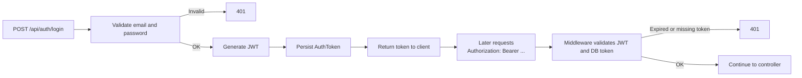
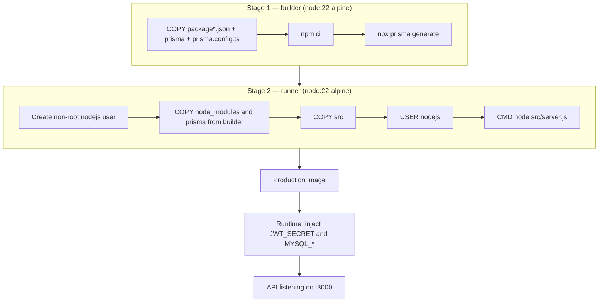
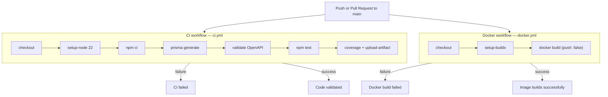
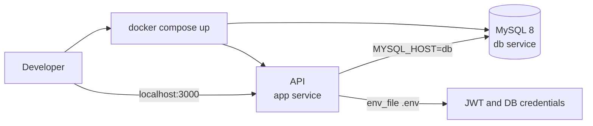

# Project flowcharts

Visual reference for the main API, Docker, and CI/CD flows.

## 1. HTTP request flow (API)

## 2. Authentication flow (login → API usage)

## 3. Multi-stage Dockerfile build

The `builder` stage installs dependencies and generates the Prisma Client.  
The `runner` stage keeps only runtime artifacts, runs as a non-root user, and does not embed secrets in the image.

## 4. GitHub Actions pipelines

## 5. Docker Compose (local)

