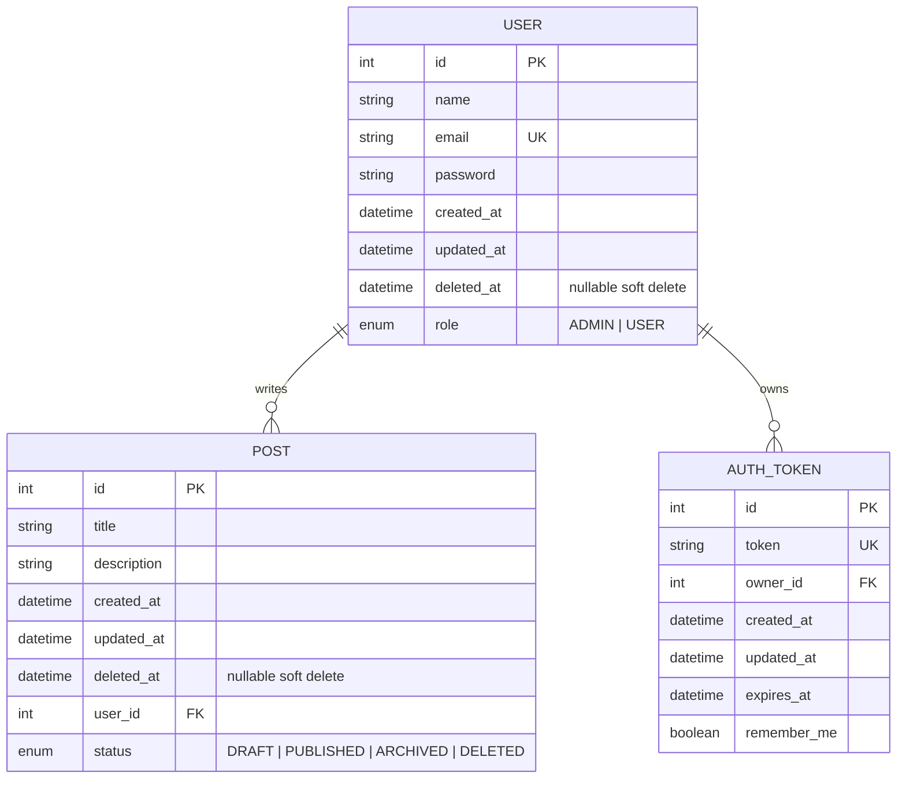

# Entity-Relationship Model (ER)

Reference for the MySQL schema defined in `prisma/schema.prisma`.

## Overview

| Entity | Table | Description |
|--------|-------|-------------|
| **User** | `user` | Platform user (teacher / admin) |
| **Post** | `post` | Blog lesson / publication |
| **AuthToken** | `auth_token` | Persisted JWT (logout, expiry, remember me) |

Enums:

| Enum | Values |
|------|--------|
| `Role` (`role`) | `ADMIN`, `USER` |
| `PostStatus` (`post_status`) | `DRAFT`, `PUBLISHED`, `ARCHIVED`, `DELETED` |

## ER diagram

## Cardinalities

| Relationship | Cardinality | Rule |
|--------------|-------------|------|
| User → Post | **1 : N** | One user may author many posts; each post has a single author (`user_id`) |
| User → AuthToken | **1 : N** | One user may hold multiple active tokens (sessions / devices) |

## Business rules

- `email` is unique.
- Soft delete on `User` and `Post` via `deleted_at` (row is kept).
- `AuthToken.token` is unique and stores the JWT in the database (logout / invalidation).
- `remember_me` affects token expiry in the auth layer.
- `role` drives authorization (e.g. admin user management and post writes).

## Attribute notes

### User
- `password`: stored as a hash (never returned in API responses)
- `role`: defaults to `USER`

### Post
- `status`: defaults to `DRAFT`
- `user_id`: required FK to `user.id`

### AuthToken
- `owner_id`: FK to `user.id`
- `expires_at`: session expiry timestamp

## Notes

This diagram matches the logical schema used by the application.  
Versioned migrations live under `prisma/migrations/`.
